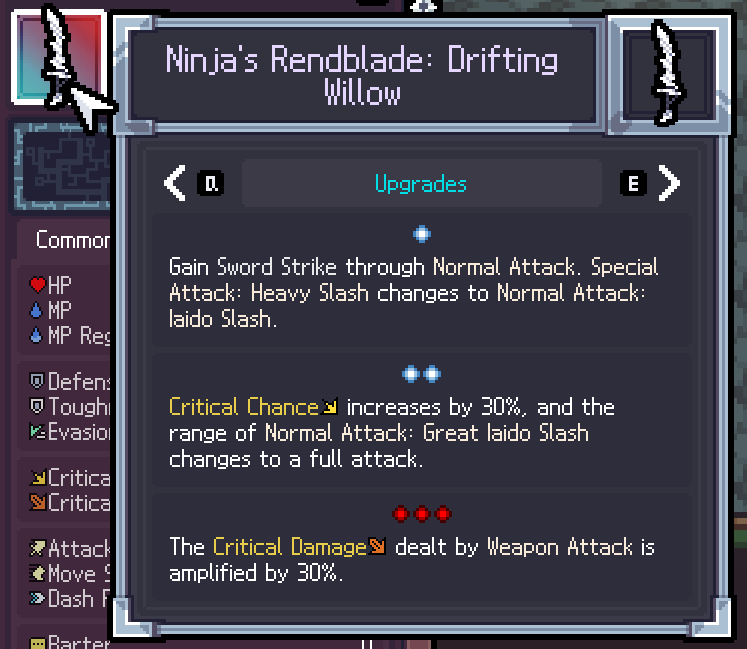
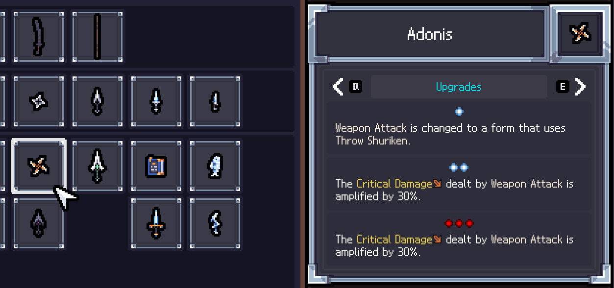

# ArcaneForged

## 📌 Overview

This mod adds a special third weapon upgrade for TEAM HORAY's <a href="https://store.steampowered.com/app/2436940/_/">Sephiria</a>.

For the third weapon upgrade, you can select another weapon and gain some of its abilities.



You can check which abilities you will gain in the journal.



## 📥 Installation
1. Download the latest `ArcaneForged-0.X.X.zip` from the Releases section and unzip it.
2. Create an `AddOns` folder inside the `Program Files (x86)\Steam\steamapps\common\Sephiria` folder.
3. Copy the `ArcaneForged` folder into the `Program Files (x86)\Steam\steamapps\common\Sephiria\AddOns` folder.

Example:
```
Sephiria/
└── AddOns/
    └── ArcaneForged/
        ├── Assets/
        ├── Libs/
        ├── metadata.json
        ├── MiraModBase.dll
        └── SephiriaArcaneForged.dll
```

## 📝 Notes
- This repository and its contributors are in no way affiliated with Sephiria, TEAM HORAY, or any related organizations.
- When playing in multiplayer, everyone—both the host and all clients—must have this mod installed. Please make sure everyone agrees before playing.